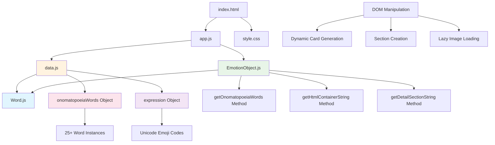
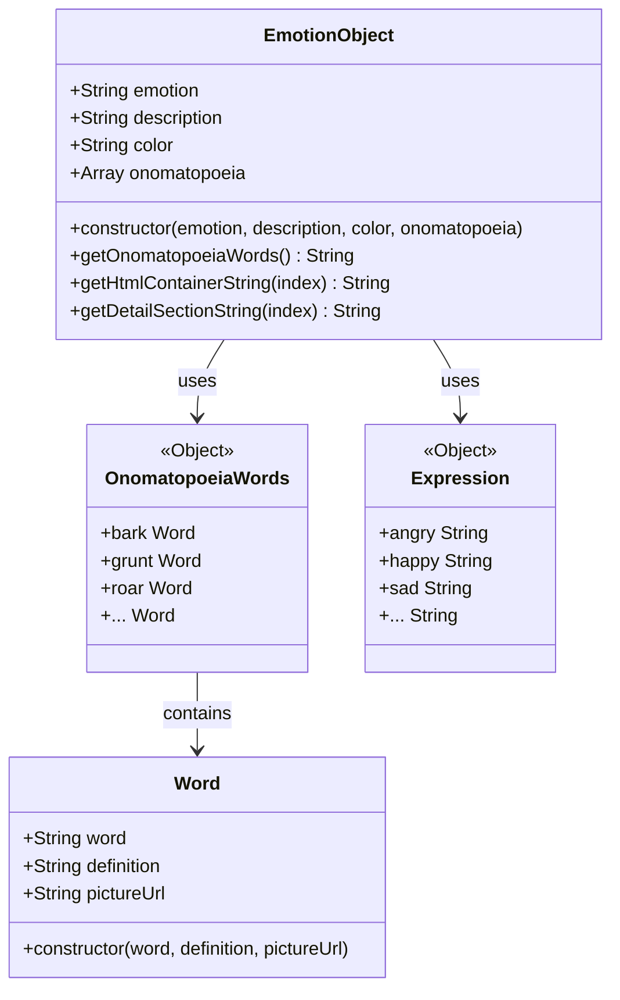
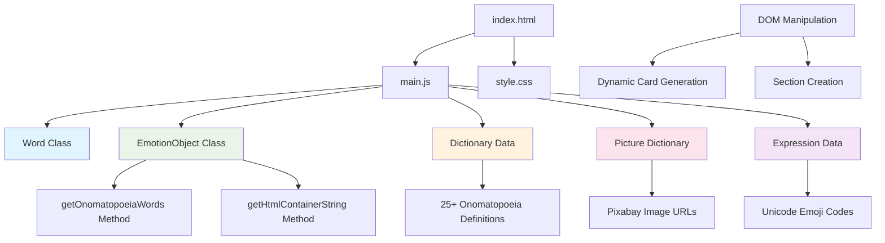
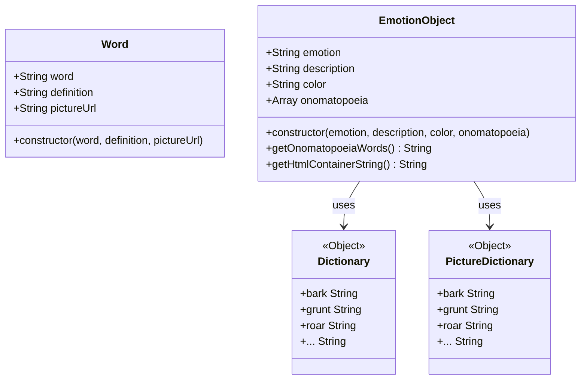

# Emotional Onomatopoeia Dictionary

# Emotional Onomatopoeia Dictionary

感情とオノマトペ（擬音語・擬態語）を関連付けたインタラクティブな辞書アプリケーションです。7つの基本感情（怒り、幸せ、悪い、悲しい、驚き、恐怖、嫌悪）に関連するオノマトペを視覚的に学習できます。各感情は色分けされ、対応する絵文字と詳細な説明、関連するオノマトペの定義と画像が表示されます。

## 特徴

- 🎨 **視覚的な学習**: 感情ごとに色分けされた直感的なインターフェース
- 😊 **絵文字表示**: 各感情に対応する Unicode 絵文字で視覚的に理解
- 🔊 **豊富なオノマトペ**: 25個以上の英語オノマトペとその定義
- 🖼️ **画像付き説明**: 各オノマトペに関連する画像で理解を深める
- 📱 **レスポンシブデザイン**: Bootstrap を使用したモバイル対応
- 🚀 **軽量**: バニラ JavaScript で実装された高速なアプリケーション

## このプロジェクトを通して学べること・習得できること

### フロントエンド開発の基礎
- **HTML5 セマンティクス**: 適切な文書構造とアクセシビリティの実装
- **CSS3 スタイリング**: モダンな CSS プロパティと flexbox レイアウト
- **レスポンシブウェブデザイン**: Bootstrap フレームワークの実践的活用

### JavaScript プログラミング
- **オブジェクト指向プログラミング (OOP)**: 
  - `Word` クラスと `EmotionObject` クラスの設計と実装
  - カプセル化とメソッドの活用
  - コンストラクタパターンの理解
- **DOM 操作**: 
  - 動的な HTML 生成と要素の作成
  - `createElement`, `appendChild`, `innerHTML` の適切な使い分け
  - イベント処理とユーザーインタラクション
- **データ構造の活用**:
  - オブジェクトリテラルによる辞書データの管理
  - 配列操作とループ処理
  - 関連データの効率的な参照方法

### ソフトウェア設計パターン
- **MVCアーキテクチャの基礎**:
  - データ層（data.js）
  - ビュー層（EmotionObject.js のHTML生成メソッド）
  - コントローラー層（app.js のDOM操作）
- **関心の分離 (Separation of Concerns)**:
  - データ定義とビジネスロジックの分離
  - プレゼンテーション層とデータ層の独立性

### プロジェクト構造と管理
- **ファイル組織**: HTML, CSS, JavaScript の適切な分離
- **ES6モジュール**: import/export による依存関係管理
- **命名規則**: 一貫性のある変数名とクラス名の設計
- **コード可読性**: メンテナブルなコード構造の実装



## ファイル構造

```
emotional-onomatopoeia-dictionary/
├── index.html          # メインHTMLファイル
├── app.js             # アプリケーションのエントリーポイント
├── style.css          # スタイルシート
├── EmotionObject.js   # 感情オブジェクトクラス
├── Word.js            # 単語クラス
├── data.js            # オノマトペと絵文字データ
└── README.md          # プロジェクト説明
```

## 必要条件

- モダンなウェブブラウザ（Chrome, Firefox, Safari, Edge）
- ES6モジュール対応（モダンブラウザは標準対応）
- インターネット接続（Bootstrap CDN と画像読み込みのため）

## インストール手順

1. **リポジトリのクローン**
```bash
git clone https://github.com/your-username/emotional-onomatopoeia-dictionary.git
cd emotional-onomatopoeia-dictionary
```

2. **ファイルの確認**
```bash
ls -la
# index.html, app.js, style.css, EmotionObject.js, Word.js, data.js が存在することを確認
```

3. **アプリケーションの起動**
```bash
# ローカルサーバーを起動（推奨：ES6モジュール使用のため）
python -m http.server 8000
# または
npx serve .
```

4. **ブラウザでアクセス**
```
http://localhost:8000
```

## 使用方法

1. ブラウザで `index.html` を開く
2. メイン画面で7つの感情カードから興味のある感情をクリック
3. 選択した感情に関連するオノマトペ一覧が表示される
4. 各オノマトペの定義と関連画像を確認する
5. 他の感情も同様に探索する

## 機能一覧

- **感情カード表示**: 7つの基本感情を色分けして表示
- **オノマトペ辞書**: 各感情に関連する英語オノマトペの定義
- **画像付き説明**: Pixabay からの関連画像表示
- **遅延読み込み**: Intersection Observer APIによる画像の最適化読み込み
- **絵文字表現**: Unicode 絵文字による感情の視覚化
- **レスポンシブレイアウト**: デバイスサイズに応じた表示調整
- **スムーズスクロール**: アンカーリンクによるページ内ナビゲーション

## 技術スタック

### フロントエンド
- **HTML5**: セマンティックマークアップ
- **CSS3**: カスタムプロパティとFlexboxレイアウト
- **JavaScript (ES6+)**: モジュールシステム、クラス構文
- **Bootstrap 4.1.3**: レスポンシブデザインフレームワーク
- **Font Awesome 6.1.2**: アイコンライブラリ

### JavaScript機能
- **ES6 モジュール**: import/export による依存関係管理
- **Intersection Observer API**: 遅延画像読み込み
- **DocumentFragment**: DOM操作の最適化

### データソース
- **Pixabay API**: オノマトペ関連画像
- **Unicode Emoji**: 感情表現用絵文字

### 開発ツール
- **ブラウザ開発者ツール**: デバッグとテスト
- **Git**: バージョン管理

## 追加資料

### クラス図


## 貢献方法

プロジェクトへの貢献を歓迎します：

1. **新機能の提案**
   - 新しい感情カテゴリの追加
   - 多言語対応の実装
   - 音声再生機能の追加

2. **バグ報告**
   - Issues タブでバグを報告
   - 再現手順と環境情報を含める

3. **Pull Request**
   ```bash
   # フォークしてクローン
   git clone https://github.com/your-username/emotional-onomatopoeia-dictionary.git
   
   # フィーチャーブランチを作成
   git checkout -b feature/new-emotion-category
   
   # 変更をコミット
   git commit -m "Add new emotion category: excited"
   
   # プッシュしてPRを作成
   git push origin feature/new-emotion-category
   ```

4. **改善提案**
   - UI/UX の改善案
   - パフォーマンス最適化
   - アクセシビリティの向上

## ライセンス

このプロジェクトは [MIT License](LICENSE) の下で公開されています。

---

**開発者**: あなたの名前  
**バージョン**: 1.0.0  
**最終更新**: 2024年# Emotional Onomatopoeia Dictionary

感情とオノマトペ（擬音語・擬態語）を関連付けたインタラクティブな辞書アプリケーションです。7つの基本感情（怒り、幸せ、悪い、悲しい、驚き、恐怖、嫌悪）に関連するオノマトペを視覚的に学習できます。各感情は色分けされ、対応する絵文字と詳細な説明、関連するオノマトペの定義と画像が表示されます。

## 特徴

- 🎨 **視覚的な学習**: 感情ごとに色分けされた直感的なインターフェース
- 😊 **絵文字表示**: 各感情に対応する Unicode 絵文字で視覚的に理解
- 🔊 **豊富なオノマトペ**: 25個以上の英語オノマトペとその定義
- 🖼️ **画像付き説明**: 各オノマトペに関連する画像で理解を深める
- 📱 **レスポンシブデザイン**: Bootstrap を使用したモバイル対応
- 🚀 **軽量**: バニラ JavaScript で実装された高速なアプリケーション

## このプロジェクトを通して学べること・習得できること

### フロントエンド開発の基礎
- **HTML5 セマンティクス**: 適切な文書構造とアクセシビリティの実装
- **CSS3 スタイリング**: モダンな CSS プロパティと flexbox レイアウト
- **レスポンシブウェブデザイン**: Bootstrap フレームワークの実践的活用

### JavaScript プログラミング
- **オブジェクト指向プログラミング (OOP)**: 
  - `Word` クラスと `EmotionObject` クラスの設計と実装
  - カプセル化とメソッドの活用
  - コンストラクタパターンの理解
- **DOM 操作**: 
  - 動的な HTML 生成と要素の作成
  - `createElement`, `appendChild`, `innerHTML` の適切な使い分け
  - イベント処理とユーザーインタラクション
- **データ構造の活用**:
  - オブジェクトリテラルによる辞書データの管理
  - 配列操作とループ処理
  - 関連データの効率的な参照方法

### ソフトウェア設計パターン
- **MVCアーキテクチャの基礎**:
  - データ層（data.js）
  - ビュー層（EmotionObject.js のHTML生成メソッド）
  - コントローラー層（app.js のDOM操作）
- **関心の分離 (Separation of Concerns)**:
  - データ定義とビジネスロジックの分離
  - プレゼンテーション層とデータ層の独立性

### プロジェクト構造と管理
- **ファイル組織**: HTML, CSS, JavaScript の適切な分離
- **ES6モジュール**: import/export による依存関係管理
- **命名規則**: 一貫性のある変数名とクラス名の設計
- **コード可読性**: メンテナブルなコード構造の実装


## ファイル構造

```
emotional-onomatopoeia-dictionary/
├── index.html          # メインHTMLファイル
├── app.js             # アプリケーションのエントリーポイント
├── style.css          # スタイルシート
├── EmotionObject.js   # 感情オブジェクトクラス
├── Word.js            # 単語クラス
├── data.js            # オノマトペと絵文字データ
└── README.md          # プロジェクト説明
```

## 必要条件

- モダンなウェブブラウザ（Chrome, Firefox, Safari, Edge）
- ES6モジュール対応（モダンブラウザは標準対応）
- インターネット接続（Bootstrap CDN と画像読み込みのため）

## インストール手順

1. **リポジトリのクローン**
```bash
git clone https://github.com/your-username/emotional-onomatopoeia-dictionary.git
cd emotional-onomatopoeia-dictionary
```

2. **ファイルの確認**
```bash
ls -la
# index.html, app.js, style.css, EmotionObject.js, Word.js, data.js が存在することを確認
```

3. **アプリケーションの起動**
```bash
# ローカルサーバーを起動（推奨：ES6モジュール使用のため）
python -m http.server 8000
# または
npx serve .
```

4. **ブラウザでアクセス**
```
http://localhost:8000
```

## 使用方法

1. ブラウザで `index.html` を開く
2. メイン画面で7つの感情カードから興味のある感情をクリック
3. 選択した感情に関連するオノマトペ一覧が表示される
4. 各オノマトペの定義と関連画像を確認する
5. 他の感情も同様に探索する

## 機能一覧

- **感情カード表示**: 7つの基本感情を色分けして表示
- **オノマトペ辞書**: 各感情に関連する英語オノマトペの定義
- **画像付き説明**: Pixabay からの関連画像表示
- **遅延読み込み**: Intersection Observer APIによる画像の最適化読み込み
- **絵文字表現**: Unicode 絵文字による感情の視覚化
- **レスポンシブレイアウト**: デバイスサイズに応じた表示調整
- **スムーズスクロール**: アンカーリンクによるページ内ナビゲーション

## 技術スタック

### フロントエンド
- **HTML5**: セマンティックマークアップ
- **CSS3**: カスタムプロパティとFlexboxレイアウト
- **JavaScript (ES6+)**: モジュールシステム、クラス構文
- **Bootstrap 4.1.3**: レスポンシブデザインフレームワーク
- **Font Awesome 6.1.2**: アイコンライブラリ

### JavaScript機能
- **ES6 モジュール**: import/export による依存関係管理
- **Intersection Observer API**: 遅延画像読み込み
- **DocumentFragment**: DOM操作の最適化

### データソース
- **Pixabay API**: オノマトペ関連画像
- **Unicode Emoji**: 感情表現用絵文字

### 開発ツール
- **ブラウザ開発者ツール**: デバッグとテスト
- **Git**: バージョン管理

## 追加資料

### クラス図


## 貢献方法

プロジェクトへの貢献を歓迎します：

1. **新機能の提案**
   - 新しい感情カテゴリの追加
   - 多言語対応の実装
   - 音声再生機能の追加

2. **バグ報告**
   - Issues タブでバグを報告
   - 再現手順と環境情報を含める

3. **Pull Request**
   ```bash
   # フォークしてクローン
   git clone https://github.com/your-username/emotional-onomatopoeia-dictionary.git
   
   # フィーチャーブランチを作成
   git checkout -b feature/new-emotion-category
   
   # 変更をコミット
   git commit -m "Add new emotion category: excited"
   
   # プッシュしてPRを作成
   git push origin feature/new-emotion-category
   ```

4. **改善提案**
   - UI/UX の改善案
   - パフォーマンス最適化
   - アクセシビリティの向上

## ライセンス

このプロジェクトは [MIT License](LICENSE) の下で公開されています。

---

**開発者**: あなたの名前  
**バージョン**: 1.0.0  
**最終更新**: 2024年感情とオノマトペ（擬音語・擬態語）を関連付けたインタラクティブな辞書アプリケーションです。7つの基本感情（怒り、幸せ、悪い、悲しい、驚き、恐怖、嫌悪）に関連するオノマトペを視覚的に学習できます。各感情は色分けされ、対応する絵文字と詳細な説明、関連するオノマトペの定義と画像が表示されます。

## 特徴

- 🎨 **視覚的な学習**: 感情ごとに色分けされた直感的なインターフェース
- 😊 **絵文字表示**: 各感情に対応する Unicode 絵文字で視覚的に理解
- 🔊 **豊富なオノマトペ**: 25個以上の英語オノマトペとその定義
- 🖼️ **画像付き説明**: 各オノマトペに関連する画像で理解を深める
- 📱 **レスポンシブデザイン**: Bootstrap を使用したモバイル対応
- 🚀 **軽量**: バニラ JavaScript で実装された高速なアプリケーション

## このプロジェクトを通して学べること・習得できること

### フロントエンド開発の基礎
- **HTML5 セマンティクス**: 適切な文書構造とアクセシビリティの実装
- **CSS3 スタイリング**: モダンな CSS プロパティと flexbox レイアウト
- **レスポンシブウェブデザイン**: Bootstrap フレームワークの実践的活用

### JavaScript プログラミング
- **オブジェクト指向プログラミング (OOP)**: 
  - `Word` クラスと `EmotionObject` クラスの設計と実装
  - カプセル化とメソッドの活用
  - コンストラクタパターンの理解
- **DOM 操作**: 
  - 動的な HTML 生成と要素の作成
  - `createElement`, `appendChild`, `innerHTML` の適切な使い分け
  - イベント処理とユーザーインタラクション
- **データ構造の活用**:
  - オブジェクトリテラルによる辞書データの管理
  - 配列操作とループ処理
  - 関連データの効率的な参照方法

### ソフトウェア設計パターン
- **MVC アーキテクチャの基礎**:
  - データ層（辞書オブジェクト）
  - ビュー層（HTML 生成メソッド）
  - コントローラー層（DOM 操作）
- **関心の分離 (Separation of Concerns)**:
  - データ定義とビジネスロジックの分離
  - プレゼンテーション層とデータ層の独立性

### プロジェクト構造と管理
- **ファイル組織**: HTML, CSS, JavaScript の適切な分離
- **命名規則**: 一貫性のある変数名とクラス名の設計
- **コード可読性**: メンテナブルなコード構造の実装



## 必要条件

- モダンなウェブブラウザ（Chrome, Firefox, Safari, Edge）
- インターネット接続（Bootstrap CDN と画像読み込みのため）

## インストール手順

1. **リポジトリのクローン**
```bash
git clone https://github.com/your-username/emotional-onomatopoeia-dictionary.git
cd emotional-onomatopoeia-dictionary
```

2. **ファイルの確認**
```bash
ls -la
# index.html, main.js, style.css が存在することを確認
```

3. **アプリケーションの起動**
```bash
# ローカルサーバーを起動（推奨）
python -m http.server 8000
# または
npx serve .
```

4. **ブラウザでアクセス**
```
http://localhost:8000
```

## 使用方法

1. ブラウザで `index.html` を開く
2. メイン画面で7つの感情カードから興味のある感情をクリック
3. 選択した感情に関連するオノマトペ一覧が表示される
4. 各オノマトペの定義と関連画像を確認する
5. 他の感情も同様に探索する

## 機能一覧

- **感情カード表示**: 7つの基本感情を色分けして表示
- **オノマトペ辞書**: 各感情に関連する英語オノマトペの定義
- **画像付き説明**: Pixabay からの関連画像表示
- **絵文字表現**: Unicode 絵文字による感情の視覚化
- **レスポンシブレイアウト**: デバイスサイズに応じた表示調整
- **スムーズスクロール**: アンカーリンクによるページ内ナビゲーション

## 技術スタック

### フロントエンド
- **HTML5**: セマンティックマークアップ
- **CSS3**: カスタムスタイリング
- **JavaScript (ES6+)**: バニラ JavaScript
- **Bootstrap 4.1.3**: レスポンシブデザインフレームワーク
- **Font Awesome 6.1.2**: アイコンライブラリ

### データソース
- **Pixabay API**: オノマトペ関連画像
- **Unicode Emoji**: 感情表現用絵文字

### 開発ツール
- **ブラウザ開発者ツール**: デバッグとテスト
- **Git**: バージョン管理

## 追加資料

### クラス図


## 貢献方法

プロジェクトへの貢献を歓迎します：

1. **新機能の提案**
   - 新しい感情カテゴリの追加
   - 多言語対応の実装
   - 音声再生機能の追加

2. **バグ報告**
   - Issues タブでバグを報告
   - 再現手順と環境情報を含める

3. **Pull Request**
   ```bash
   # フォークしてクローン
   git clone https://github.com/your-username/emotional-onomatopoeia-dictionary.git
   
   # フィーチャーブランチを作成
   git checkout -b feature/new-emotion-category
   
   # 変更をコミット
   git commit -m "Add new emotion category: excited"
   
   # プッシュしてPRを作成
   git push origin feature/new-emotion-category
   ```

4. **改善提案**
   - UI/UX の改善案
   - パフォーマンス最適化
   - アクセシビリティの向上

## ライセンス

このプロジェクトは [MIT License](LICENSE) の下で公開されています。

---

**開発者**: あなたの名前  
**バージョン**: 1.0.0  
**最終更新**: 2024年